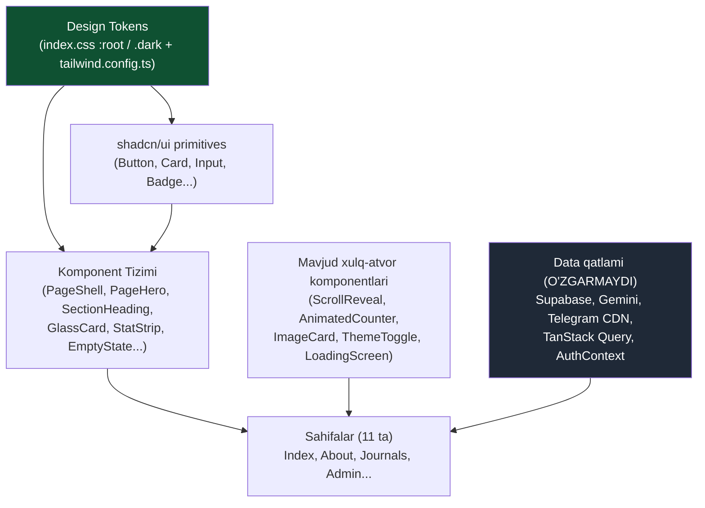
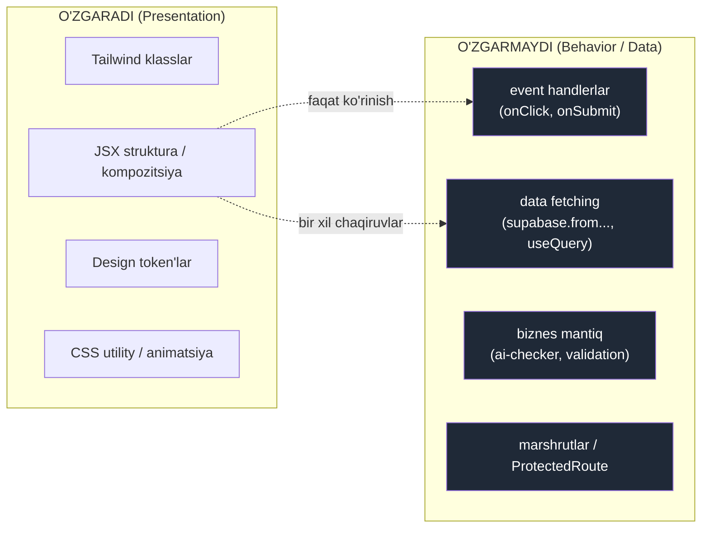
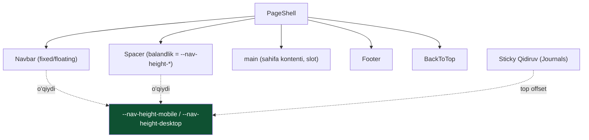
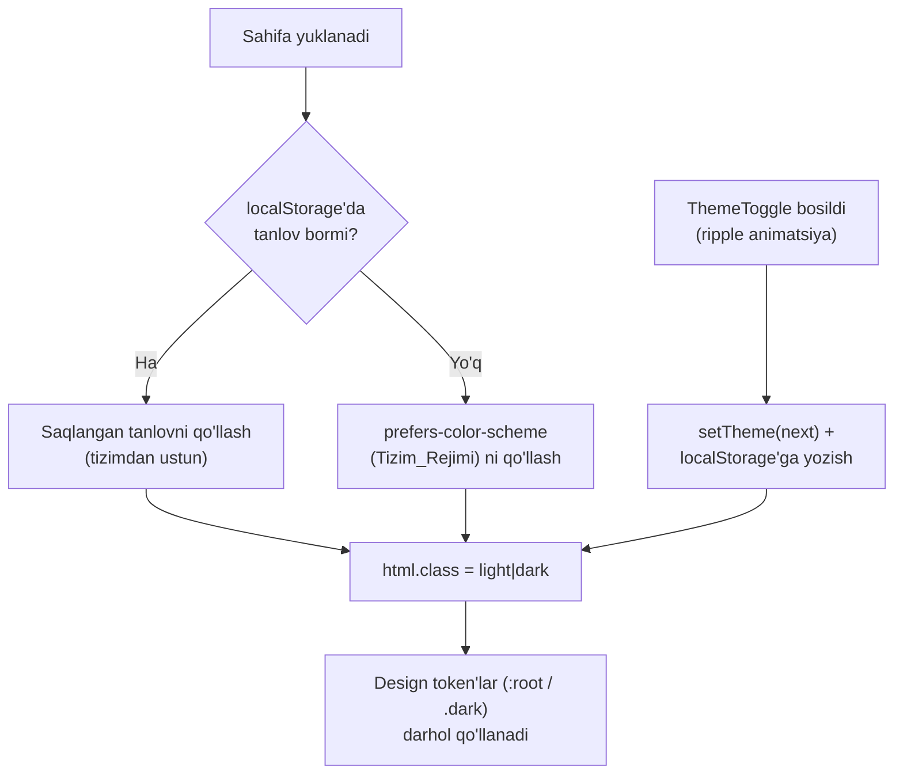
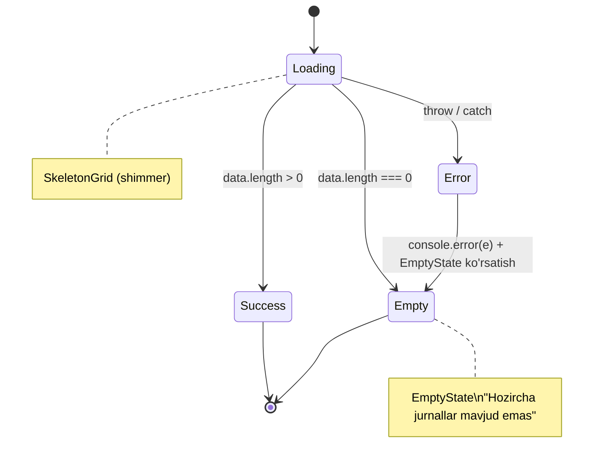

# Dizayn Hujjati

## Overview

Ushbu hujjat ISCAD "Agroiqtisodiyot" ilmiy-amaliy jurnali saytining to'liq, jasur (bold) vizual redizaynining texnik dizaynini belgilaydi. Maqsad — "oddiy sayt" emas, balki tashrif buyuruvchida darhol "wow" taassuroti uyg'otadigan, premium ("10000$ vibe") va esda qoladigan vizual identifikatsiya yaratish. Eng muhim cheklov o'zgarishsiz qoladi: redizayn faqat **taqdimot (presentation) qatlamini** o'zgartiradi; barcha mavjud funksionallik (Supabase auth, jurnal CRUD, Telegram CDN, Gemini AI tekshirish, kontakt formasi, tahrir hay'ati, Telegram Web App, pagination, qidiruv, LoadingScreen, blurhash) regressiyasiz ishlashda davom etadi.

### Redizayn falsafasi: "Editorial × Modern Tech"

Yangi dizayn yo'nalishi ikki dunyoni birlashtiradi:

- **Editorial (ilmiy nufuz):** Playfair Display serif sarlavhalari, kuchli tipografik ierarxiya, kengaytirilgan bo'shliq (whitespace), eyebrow/kicker yorliqlar va nashr (publication) hissi — bu jurnalga akademik vaznlik va ishonch beradi.
- **Modern Tech (mahsulot silliqligi):** zamonaviy SaaS mahsulotlaridek tez, silliq, izchil motion tili; aniq token tizimi; nozik glassmorphism; maqsadli micro-interaction'lar.

### "10000$ vibe" ni texnik tushunish

"Premium his" tasodifiy emas — u quyidagi aniq prinsiplardan kelib chiqadi. Bular dizaynning o'zgarmas qonunlari:

1. **Kamroq, lekin sifatliroq effekt.** Joriy holatda juda ko'p raqobatlashuvchi effektlar bor (parallax + 3D tilt + ken-burns + glow-blob + grid + mesh-gradient bir ekranda). Yangi dizayn har bir ekranda **bitta asosiy vizual moment** ("hero moment") tanlaydi va qolganini yengillashtiradi. Bu "shovqin"ni kamaytirib, idrokni premiumga aylantiradi.
2. **Kuchli tipografik ierarxiya.** Aniq display → heading → body → caption shkalasi. Sarlavhalar dadil va katta; matn nafas oladi. Hech qachon 12px dan kichik mazmunli matn yo'q (joriy `text-[7px]`...`text-[10px]` muammosi bartaraf etiladi — R7.1).
3. **Sahifa bo'ylab nafas (whitespace).** Bo'limlar orasida izchil, saxiy vertikal ritm; kontent kengligi cheklangan (readable measure).
4. **Izchil motion tili.** Bitta standart easing va davomiylik shkalasi butun sayt bo'ylab. Reveal, hover va press — bir xil "tilda" gapiradi.
5. **Premium detallar (signature moments).** Saqlanadigan va kuchaytiriladigan "imzo" detallari: ThemeToggle suv-tomchisi (ripple) o'tishi, magnetic/lift hover, silliq scroll reveal, blurhash → rasm o'tishi, 3D jurnal muqovasi (lekin yumshatilgan).
6. **Izchillik = nufuz.** Barcha 11 sahifa + Navbar + Footer yagona Dizayn_Tilida. Admin paneli ham qolgan sayt bilan bir xil premium ko'rinishga keltiriladi (joriy holatda u ajralib turadi — R3.8).

### Tanlangan vizual konsepsiya: "Cultivated Future" (Yetishtirilgan Kelajak)

Brendning agro/ilmiy mohiyatini saqlash uchun **emerald (botanika yashili) asos saqlanadi**, lekin u boyitiladi va nafislashtiriladi:

- **Asosiy (primary):** chuqur, to'yingan **Botanik Emerald** — neon emas, balki nufuzli, "qadimiy o'rmon" yashili.
- **Aksent (accent):** neon-oltindan voz kechib, **nafis guruch/oltin (brass)** tomon siljish — bu "muzey/nashr" hissini beradi, arzon ko'rinmaydi.
- **Neytral baza:** light rejimda **iliq marvarid (warm pearl / paper)**, dark rejimda yashil tagrangli **chuqur siyoh (deep ink)**. Bu kontrast premium va ko'zga qulay.

Bu yo'nalish Requirement 1.2 ni qondiradi: kompozitsiya tamoyillari (bitta hero moment, kuchli tipografik ierarxiya, saxiy whitespace) va rang palitrasi (neon → nafis nuance) tubdan yangilanadi, ayni paytda brend identifikatsiyasi (agro-emerald) tanib olinadigan qoladi.

### Texnologiya konteksti (o'zgarmaydi)

React 18 + Vite + TypeScript + Tailwind CSS 3.4 + shadcn/ui (Radix), `darkMode: 'class'`, `next-themes`, react-router-dom v6, Supabase, TanStack Query, Telegram CDN, Gemini API. Redizayn ushbu to'plam ichida, asosan `src/index.css` (token'lar va utility'lar), `tailwind.config.ts` (token map) hamda har sahifa/komponentning JSX/Tailwind klasslari darajasida amalga oshiriladi.

---

## Architecture

### Yondashuvning umumiy tamoyili

Redizayn **token-birinchi (token-first)** yondashuvga asoslanadi: avval markazlashgan Dizayn_Tili token'lari (`src/index.css` CSS o'zgaruvchilari + `tailwind.config.ts` map) yangilanadi, so'ngra qayta ishlatiladigan Komponent_Tizimi shu token'lar ustiga quriladi, va nihoyat har bir Sahifa shu komponentlar yordamida qayta tuziladi. Bu Requirement 1.3 (hardcoded qiymatlardan qochish), 1.4 (izchillik) va 2 (qayta ishlatiladigan komponentlar) ni strukturaviy darajada kafolatlaydi.



### Qatlamli arxitektura va mas'uliyat chegarasi

Eng muhim arxitektura qarori — **taqdimot va data o'rtasidagi qat'iy chegara**. Redizayn faqat yuqori (presentation) qatlamga tegadi:



Amaliy qoida: komponentni qayta yozishda **handler funksiyalari, `useEffect`/`useQuery` chaqiruvlari, Supabase/Gemini/Telegram chaqiruvlari va props nomlari ko'chirilmaydi** — faqat ularni o'rab turuvchi markup va klasslar yangilanadi. Bu Requirement 4 (regressiyasiz) ning strukturaviy kafolati.

### Layout Shell (markazlashgan tartib)

Joriy holatda har sahifa `<Navbar />` ... `<Footer />` ni qo'lda takrorlaydi va navbar balandligi/spacer/sticky offset qiymatlari sahifalararo tarqoq (R5 ning ildiz sababi). Yechim — **`PageShell` layout wrapper** va **bitta manbali navbar balandligi tokeni**.



Navbar balandligi yagona CSS o'zgaruvchi orqali e'lon qilinadi va Navbar, Spacer hamda Sticky_Qidiruv_Paneli **ayni shu manbadan** foydalanadi. Natijada R5.2 (spacer = navbar balandligi), R5.3/5.4/5.5 (sticky search navbar ostiga aniq yopishadi, mobil/desktop offset mos) bitta joyda hal qilinadi va kelajakda nomuvofiqlik qaytib kelmaydi.

### Theme arxitekturasi (R6)

`next-themes` saqlanadi, lekin sozlamalari tuzatiladi: tizim rejimini hurmat qilish yoqiladi.



`src/App.tsx` da `ThemeProvider` sozlamasi `attribute="class" defaultTheme="system" enableSystem` ga o'zgartiriladi (joriy `defaultTheme="light" enableSystem={false}` o'rniga). ThemeToggle ning suv-tomchi ripple effekti **saqlanadi** (signature detal). FOUC (theme miltillashi) ni kamaytirish uchun Vite SPA kontekstida `index.html`'ga `<head>` ichida kichik, bloklovchi inline skript qo'shiladi: u `localStorage` va `prefers-color-scheme` ni o'qib, React mount bo'lishidan oldin `documentElement`'ga `dark` klassini qo'yadi (pastdagi Error Handling bo'limiga qarang).

### Faylga ta'sir xaritasi

| Sath | Fayl(lar) | O'zgarish turi |
|------|-----------|----------------|
| Token'lar | `src/index.css` (`:root`, `.dark`, utility'lar), `tailwind.config.ts` | Qiymatlarni yangilash, yangi token'lar qo'shish, `sans` font xatosini tuzatish |
| Theme | `src/App.tsx`, `index.html` | `ThemeProvider` props, anti-FOUC inline skript |
| Yangi komponentlar | `src/components/layout/*`, `src/components/ui-system/*` | Yangi qayta ishlatiladigan komponentlar |
| Sahifalar | `src/pages/*.tsx` (11 ta) | Faqat markup/klasslar qayta tuziladi |
| Footer/Navbar | `src/components/Footer.tsx`, `Navbar.tsx` | Markup/klasslar + navbar balandlik tokeni |
| Data/logika | `*` (Supabase, Gemini, Telegram, AuthContext) | **O'zgarmaydi** |

---

## Components and Interfaces

Komponent_Tizimi shadcn/ui (Radix) primitivlari **ustiga** quriladi va ularning xulq-atvori hamda foydalanish qulayligi (accessibility) xususiyatlarini saqlaydi (R2.3). Har bir komponent token asosidagi variantlar orqali ko'rinishlarni boshqaradi (R2.4); inline rang/o'lcham qiymatlari ishlatilmaydi (R1.3, R12.2).

### 1. Layout va sahifa karkasi

**`PageShell`** — barcha sahifalar uchun yagona tartib wrapper'i.

```typescript
interface PageShellProps {
  children: React.ReactNode;
  /** Footer'ni yashirish kerak bo'lsa (masalan Telegram ilova) */
  hideFooter?: boolean;
  /** BackToTop tugmasini ko'rsatish (standart: true) */
  showBackToTop?: boolean;
  /** main konteyneriga qo'shimcha klasslar */
  className?: string;
}
```

Mas'uliyati: `<Navbar/>` + balandlik tokeniga bog'langan Spacer + `<main>` (slot) + `<Footer/>` + `<BackToTop/>` ni izchil tartibda chiqarish. Bu R3.12 (Navbar/Footer barcha sahifalarda izchil) va R5.2 ni markazlashtiradi.

**`PageHero`** — sahifa boshidagi yagona "hero moment" bloki.

```typescript
interface PageHeroProps {
  eyebrow?: string;            // kicker/yorliq (uppercase, tracking)
  title: string;              // serif display sarlavha
  description?: string;
  /** Fon rasmi (mavjud /assets/*-hero.webp) yoki yo'q */
  backgroundImage?: string;
  /** Hero balandlik varianti */
  size?: 'sm' | 'md' | 'lg';
  /** CTA tugmalar slot'i */
  actions?: React.ReactNode;
  /** Dekorativ ikona (alt="" bilan) */
  icon?: LucideIcon;
}
```

Hero ken-burns fon rasmini saqlaydi (R10.3 — mavjud preload mexanizmi), lekin parallax/grid/mesh effektlari yengillashtiriladi (bitta nozik gradient overlay + token-glow). Fon rasmi dekorativ bo'lgani uchun `alt=""` (R7.4).

### 2. Tipografika va bo'lim komponentlari

**`SectionHeading`** — bo'lim sarlavhalari uchun izchil blok (eyebrow + sarlavha + ixtiyoriy tavsif), markaz yoki chap tekislash bilan.

```typescript
interface SectionHeadingProps {
  eyebrow?: string;
  title: string;
  description?: string;
  align?: 'left' | 'center';
  as?: 'h1' | 'h2' | 'h3';   // semantik darajani boshqarish (a11y)
}
```

### 3. Karta va sirt (surface) komponentlari

**`GlassCard`** — premium glassmorphism karta, joriy `.glass-card` utility o'rnini token asosidagi variantlar bilan egallaydi.

```typescript
interface GlassCardProps extends React.HTMLAttributes<HTMLDivElement> {
  variant?: 'default' | 'elevated' | 'outline' | 'subtle';
  /** hover-lift effektini yoqish */
  interactive?: boolean;
}
```

**`FeatureCard`** — ikona + sarlavha + tavsif naqshi (Index sahifasidagi "features" bloklari uchun). `GlassCard` ustiga quriladi.

**`StatCard` / `StatStrip`** — Statistik_Bloklar. `StatStrip` bir nechta `StatCard`'ni gorizontal lentaga joylaydi. Har bir `StatCard` ichida mavjud `AnimatedCounter` qayta ishlatiladi (R9.5).

```typescript
interface StatItem {
  value: number;
  label: string;
  prefix?: string;
  suffix?: string;
  icon?: LucideIcon;
}
interface StatStripProps {
  items: StatItem[];
}
```

### 4. Tugma va teglar

**`Button`** (shadcn `button.tsx` `cva` variantlari kengaytiriladi) — yangi token asosidagi variantlar:

| Variant | Ishlatilishi |
|---------|--------------|
| `primary` (default) | asosiy CTA, emerald to'ldirish + nozik glow |
| `accent` | oltin/guruch aksent CTA |
| `outline` | ikkilamchi amal |
| `ghost` | uchlamchi / ikona tugma |
| `subtle` | kam urg'uli amal |

Joriy `glow-button-primary` / `glow-button-accent` utility'lari token asosidagi shadow'larga ko'chiriladi. Barcha tugmalar focus-visible ring tokenini meros oladi (R8.4).

**`Badge`** — `journal-badge-premium` va "AI" yorlig'i token asosida qayta ta'riflanadi; matn o'lchami minimal 12px qoidasiga rioya qiladi yoki sof dekorativ bo'lsa istisno (R7.1, R7.3).

### 5. Holat (state) komponentlari

**`EmptyState`** — Bosh_Holat bloki (R11.2).

```typescript
interface EmptyStateProps {
  icon?: LucideIcon;
  title: string;
  description?: string;
  action?: React.ReactNode;   // masalan "Qidiruvni tozalash" tugmasi
}
```

**`SkeletonGrid`** — Skeleton_Yuklash setkasi (R11.3). Mavjud shadcn `Skeleton` + `.shimmer` utility ustiga quriladi.

```typescript
interface SkeletonGridProps {
  count?: number;
  /** karta nisbati, masalan jurnal muqovasi uchun '3/4.2' */
  aspect?: string;
  columns?: { base?: number; sm?: number; md?: number; lg?: number };
}
```

### 6. Mavjud xulq-atvor komponentlari (qayta ishlatiladi, qayta yozilmaydi)

| Komponent | Holati | Eslatma |
|-----------|--------|---------|
| `ScrollReveal` | Saqlanadi | reduced-motion global CSS bilan moslashtiriladi |
| `AnimatedCounter` | Saqlanadi | StatCard ichida ishlatiladi; logika o'zgarmaydi |
| `ImageCard` | Saqlanadi | blurhash → rasm o'tishi (R4.10, R10.3) |
| `ThemeToggle` | Saqlanadi | ripple signature detal; faqat hover/focus uslubi token'lashtiriladi |
| `LoadingScreen` | Saqlanadi | preload oqimi (R4.9) o'zgarmaydi; faqat vizual token'lashtiriladi |
| `ParticleBackground` | Yengillashtiriladi | reduced-motion'da o'chadi (R10.2); ortiqcha joylarda olib tashlanadi |
| `BackToTop`, `ScrollToTop`, `ProtectedRoute` | Saqlanadi | xulq-atvor o'zgarmaydi (R4.12) |

### Komponent variantlari strategiyasi (R2.4)

Barcha variantlar `class-variance-authority` (`cva`) orqali — shadcn'ning mavjud naqshiga mos — ta'riflanadi. Variant = token-klasslar to'plami. Hech qanday variant inline `style` yoki hardcoded HSL ishlatmaydi (R12.2). Komponent_Tizimi kerakli turni bermagan kamdan-kam holatda, sahifa istisno tariqasida qo'lda markup yozishi mumkin (R2.3-istisno), lekin baribir token-klasslardan foydalanadi.

---

## Data Models

Bu redizayn **backend data modellarini o'zgartirmaydi** (jadvallar: `journals`, `contact_messages`, `editorial_board`, `profiles` — o'zgarmaydi). Bu yerdagi "data modellar" — Dizayn_Tilini ifodalovchi **design token modellari** va komponent props shartnomalari.

### Rang token'lari (HSL) — Light va Dark (R1.1, R1.6)

Token nomlari mavjud `--background`, `--primary`, `--accent` va h.k. bilan **mos saqlanadi** (qayta foydalanish va minimal regressiya uchun), lekin qiymatlar "Cultivated Future" konsepsiyasiga yangilanadi. Qo'shimcha surface darajalari kiritiladi.

**Light mode (`:root`):**

```
--background:        40 33% 98%;   /* Warm Pearl / paper */
--foreground:        190 30% 11%;  /* Deep Ink (yashil-siyoh tagrang) */

--surface-1:         0 0% 100%;    /* eng yuqori karta */
--surface-2:         40 28% 96%;   /* nozik ko'tarilgan blok */
--surface-3:         150 18% 93%;  /* alternativ bo'lim foni */

--card:              0 0% 100%;
--card-foreground:   190 30% 11%;
--popover:           0 0% 100%;
--popover-foreground:190 30% 11%;

--primary:           158 64% 22%;  /* Botanik Emerald (nufuzli, neon emas) */
--primary-foreground:40 33% 98%;

--accent:            38 64% 46%;   /* Nafis Guruch/Oltin (brass) */
--accent-foreground: 190 30% 11%;

--secondary:         150 22% 95%;
--secondary-foreground:158 40% 18%;

--muted:             200 14% 94%;
--muted-foreground:  200 12% 36%;  /* 4.5:1 dan o'tadigan kulrang (R7.2) */

--destructive:       352 70% 46%;
--destructive-foreground:0 0% 100%;

--border:            200 16% 88%;
--input:             200 16% 88%;
--ring:              158 64% 30%;

--gold:              38 64% 46%;
--gold-foreground:   190 30% 11%;
--radius:            0.875rem;
```

**Dark mode (`.dark`):**

```
--background:        190 32% 5%;   /* Deep Ink (yashil tagrang) */
--foreground:        150 16% 96%;

--surface-1:         190 24% 9%;
--surface-2:         190 22% 7.5%;
--surface-3:         190 20% 11%;

--card:              190 24% 8%;
--card-foreground:   150 16% 96%;
--popover:           190 24% 8%;
--popover-foreground:150 16% 96%;

--primary:           152 56% 50%;  /* Luminous Emerald */
--primary-foreground:190 32% 5%;

--accent:            40 78% 58%;   /* Glowing Brass */
--accent-foreground: 190 32% 5%;

--secondary:         190 20% 12%;
--secondary-foreground:150 30% 90%;

--muted:             190 16% 14%;
--muted-foreground:  150 12% 68%;  /* dark fonda 4.5:1 (R7.2) */

--destructive:       352 64% 50%;
--destructive-foreground:0 0% 100%;

--border:            190 16% 16%;
--input:             190 16% 16%;
--ring:              152 56% 52%;

--gold:              40 78% 58%;
--gold-foreground:   190 32% 5%;
```

> Kontrast eslatmasi (R7.2): yuqoridagi `--foreground`/`--background` va `--muted-foreground` juftliklari WCAG 2.1 AA (normal matn 4.5:1) ni nazarda tutib tanlangan. Yakuniy qiymatlar implementatsiyada kontrast tekshiruvchi (masalan, brauzer DevTools yoki `wcag-contrast`) bilan tasdiqlanadi; o'tmagan juftliklar `lightness` (HSL L) ni sozlash orqali to'g'rilanadi.

### Tipografika token'lari (R1.1, R7.1)

**Shrift oilalari** — `tailwind.config.ts` dagi `sans` xatosi tuzatiladi:

```typescript
fontFamily: {
  sans:    ['"Plus Jakarta Sans"', 'system-ui', '-apple-system', 'sans-serif'], // TUZATISH: Inter -> Plus Jakarta Sans
  serif:   ['"Playfair Display"', 'Georgia', 'serif'],
  display: ['"Playfair Display"', 'Georgia', 'serif'],
}
```

- **Display / sarlavhalar:** Playfair Display (ELITE editorial nufuz) — `h1`–`h3`, PageHero, SectionHeading.
- **Body / UI:** Plus Jakarta Sans — paragraf, tugma, input, nav. (`index.html` allaqachon shu ikkalasini yuklaydi; Inter yuklanmaydi, shuning uchun config tuzatilishi shart.)

**Type scale** (Tailwind standart shkalasiga moslab, minimal qoidalar bilan):

| Rol | Klass | O'lcham | Qo'llanish |
|-----|-------|---------|------------|
| Display | `text-5xl`–`text-7xl` font-serif | 48–72px | PageHero sarlavha |
| H2 | `text-3xl`–`text-4xl` font-serif | 30–36px | bo'lim sarlavhasi |
| H3 | `text-xl`–`text-2xl` font-serif | 20–24px | karta sarlavhasi |
| Body | `text-base` | 16px | asosiy matn |
| Body-sm | `text-sm` | 14px | ikkilamchi matn |
| Caption / eyebrow | `text-xs` | **12px (minimal)** | kicker, meta, teg |

**Minimal o'lcham qoidasi (R7.1):** hech qanday **mazmunli** matn `text-xs` (12px) dan kichik bo'lmaydi. Joriy `text-[7px]`, `text-[8px]`, `text-[9px]`, `text-[10px]` ishlatilishlari (Navbar AI badge, jurnal meta, modal yorliqlar va h.k.) `text-xs` ga ko'tariladi yoki sof dekorativ bo'lsa (R7.3) o'lchami saqlanishi mumkin, lekin bu holatda ekrandagi yagona ma'lumot tashuvchi bo'lmasligi kerak.

**Eyebrow/kicker qoidasi:** kichik uppercase yorliqlar `text-xs font-semibold uppercase tracking-[0.15em] text-muted-foreground` token-naqshidan foydalanadi (editorial his).

### Bo'shliq, radius, elevation, blur token'lari (R1.1)

```
/* Spacing — Tailwind 4px bazaviy shkalasi saqlanadi; bo'lim ritmi: */
--section-gap-y:  clamp(4rem, 8vw, 8rem);   /* bo'limlar orasidagi vertikal nafas */
--content-max-w:  72rem;                     /* o'qiladigan kenglik */

/* Radius (index.css'da mavjud --radius dan derivatsiya) */
--radius:        0.875rem;        /* lg */
/* md = radius - 2px, sm = radius - 4px (tailwind.config'da map qilingan) */

/* Elevation / shadow (tailwind boxShadow token'lari) */
shadow-glass:    0 8px 32px hsl(190 30% 4% / 0.08)
shadow-glass-lg: 0 16px 48px hsl(190 30% 4% / 0.12)
shadow-glow:     0 0 0 1px hsl(var(--primary)/0.18), 0 8px 30px hsl(var(--primary)/0.22)

/* Blur shkalasi (glass uchun) */
--blur-nav:  24px;
--blur-card: 16px;
```

`boxShadow` token'lari (`tailwind.config.ts`) joriy ko'k (`rgba(27,79,138,...)`) qoldiqlaridan tozalanadi va yangi emerald/ink token'lariga moslanadi (R1.4 izchillik). `navy`/`iscad` hardcoded rang oilalari — agar ishlatilmasa — olib tashlanadi yoki token tizimiga moslanadi (R12.1 ishlatilmagan kod).

### Motion token'lari (R9.1)

```
--ease-out-expo: cubic-bezier(0.16, 1, 0.3, 1);   /* standart "premium" easing */
--ease-spring:   cubic-bezier(0.34, 1.56, 0.64, 1);/* bounce (modal, toggle) */

--dur-fast:   150ms;   /* press, kichik holat */
--dur-base:   300ms;   /* hover, rang o'tishi */
--dur-slow:   500ms;   /* layout o'tishi */
--dur-reveal: 700ms;   /* scroll reveal */
```

**Motion qoidalari:**
- **Reveal:** `ScrollReveal` orqali, `--dur-reveal` + `--ease-out-expo`, translateY(~24px) + fade. Joriy katta `translateY(50px) scale + rotate3d` qiymatlari yumshatiladi (premium = nozik).
- **Hover:** `--dur-base`, lift (`translateY(-4px)`) yoki nozik scale (≤1.02). Magnetic hover faqat asosiy CTA va kartalarda.
- **Press:** `--dur-fast`, `scale(0.98)`.
- **Reduced-motion (R9.2, R9.3, R10.2):** global CSS media query (Error Handling bo'limiga qarang) takrorlanuvchi animatsiyalarni (float, ken-burns, morphing, particle, scan-laser) o'chiradi; reveal/hover'larni minimal (faqat fade yoki darhol ko'rinish) holatga keltiradi.

### Navbar balandlik token'lari (R5.2–5.5)

```
--nav-height-mobile:  64px;   /* floating navbar + pt-3 hisobga olingan effektiv balandlik */
--nav-height-desktop: 80px;
```

Spacer balandligi va Journals Sticky_Qidiruv_Paneli `top` offseti **shu o'zgaruvchilardan** hisoblanadi (masalan `top-[var(--nav-height-mobile)] lg:top-[var(--nav-height-desktop)]`). Joriy `h-16 lg:h-20` (spacer) va `top-[56px] lg:top-[64px]` (sticky) o'rtasidagi nomuvofiqlik shu bitta manba bilan bartaraf etiladi.

### Komponent props modellari

Yuqoridagi *Components and Interfaces* bo'limidagi TypeScript interfeyslari (PageShell, PageHero, SectionHeading, GlassCard, StatStrip, EmptyState, SkeletonGrid) Komponent_Tizimining commit qilinadigan shartnomasidir.

### Jurnal ma'lumot modeli (faqat manba o'zgaradi, shakl emas)

`Journal` interfeysi (`id`, `title`, `description`, `pdf_url`, `cover_image_url`, `created_at`) **o'zgarmaydi**. O'zgarish faqat shundaki: Jurnallar_Sahifasidagi `fetchJournals` ichidagi **Mock_Jurnal generatsiyasi (100 ta soxta yozuv) butunlay olib tashlanadi** (R11.1). Ro'yxat faqat Supabase qaytargan haqiqiy yozuvlardan iborat bo'ladi; bo'sh bo'lsa `EmptyState`, yuklanayotganda `SkeletonGrid`, xatoda `console.error` + `EmptyState` (R11.2–11.4).

---

## Testing Approach Rationale — Property-Based Testing qo'llanilmaydi

> **Bu funksiya uchun Property-Based Testing (PBT) qo'llanilmaydi, shuning uchun "Correctness Properties" bo'limi (universal "for all" xossalari) ataylab kiritilmagan.** Sabablar quyida.

Ushbu funksiya — **vizual redizayn**: u Dizayn_Tili token'lari, UI rendering/layout, theming, responsivlik, accessibility va mavjud xulq-atvorni saqlashga qaratilgan. Property-based testing (PBT) quyidagi sabablarga ko'ra bu funksiyaga **mos kelmaydi**, shuning uchun universal "for all" korrektlik xossalari yozilmaydi:

- **UI rendering va layout** (R1, R3, R5, R9) — vizual ko'rinish va kompozitsiya tabiati bo'yicha snapshot/visual-regression va qo'lda tekshiruvga mos, "for all input → property" shaklida emas.
- **Mavjud funksionallikni saqlash (R4)** — bular Supabase/Gemini/Telegram kabi tashqi xizmatlar bilan ishlovchi **regressiya/integratsiya** tekshiruvlari; xulq-atvor kirishga qarab mazmunli o'zgarmaydi va PBT iteratsiyalari qo'shimcha qiymat bermaydi.
- **Theme, konfiguratsiya, kontrast, fokus (R6, R7, R8)** — example-based va audit (kontrast/a11y) tekshiruvlariga mos.
- **Performans (R10), kod sifati (R12), xavfsizlik hujjati (R13)** — mos ravishda manual/profil, lint/tsc va hujjatlashtirish; PBT predmeti emas.
- Redizayn **hech qanday yangi sof funksiya, parser, serializer yoki ma'lumot transformatsiyasi mantig'ini** kiritmaydi (mavjud `getPaginationRange`, qidiruv filtri va `ai-checker` mantig'i o'zgarmaydi — R4.8).

Shu sababli pastdagi *Testing Strategy* bo'limi **unit (example/edge), integratsiya/regressiya va manual vizual + a11y** tekshiruvlariga tayanadi.

---

## Error Handling

### 1. Theme initsializatsiyasi va FOUC (R6.2, R6.5)

Vite SPA bo'lgani uchun React mount bo'lgunga qadar `<html>` da to'g'ri theme klassi bo'lmasligi mumkin — bu "miltillash" (flash of unstyled/incorrect theme) ga olib keladi. Yechim: `index.html` `<head>` ichida **bloklovchi inline skript**:

```html
<script>
  (function () {
    try {
      var stored = localStorage.getItem('theme'); // next-themes default key
      var systemDark = window.matchMedia('(prefers-color-scheme: dark)').matches;
      var useDark = stored ? stored === 'dark' : systemDark; // R6.2: tanlov yo'q -> tizim
      document.documentElement.classList.toggle('dark', useDark);
    } catch (e) {
      // R6.5: localStorage o'qib bo'lmasa (private mode va h.k.) -> tizim rejimiga qaytish
      try {
        document.documentElement.classList.toggle(
          'dark',
          window.matchMedia('(prefers-color-scheme: dark)').matches
        );
      } catch (_) { /* eng so'nggi zaxira: standart (light) qoladi */ }
    }
  })();
</script>
```

`next-themes` mount bo'lgach boshqaruvni o'z qo'liga oladi; bu skript faqat birinchi bo'yoq (first paint) uchun. `App.tsx` da `ThemeProvider` `attribute="class" defaultTheme="system" enableSystem` bilan ishlaydi; agar saqlash imkonsiz bo'lsa `next-themes` o'zi tizim rejimiga tushadi (R6.5).

### 2. Reduced-motion global strategiyasi (R9.2, R9.3, R9.4, R10.2)

`src/index.css` ga **global** media query qo'shiladi — bu har bir komponentda alohida ishlov berishni keraksiz qiladi va izchillikni kafolatlaydi:

```css
@media (prefers-reduced-motion: reduce) {
  *, *::before, *::after {
    animation-duration: 0.001ms !important;
    animation-iteration-count: 1 !important;
    transition-duration: 0.001ms !important;
    scroll-behavior: auto !important;
  }
  /* Takrorlanuvchi/diqqat chalg'ituvchi effektlarni butunlay o'chirish */
  .animate-float, .animate-ken-burns, .glow-blob,
  .animate-scan-laser, .animate-orbit, .ai-data-stream { animation: none !important; }
  /* Reveal kontenti darhol ko'rinadigan bo'lsin (R9.3: barcha mazmun o'qiladi) */
  .reveal, .reveal-left, .reveal-right, .reveal-scale, .reveal-stagger {
    opacity: 1 !important; transform: none !important;
  }
}
```

`ParticleBackground` (canvas) va parallax `scrollY` hisob-kitoblari JS darajasida `window.matchMedia('(prefers-reduced-motion: reduce)')` ni tekshirib, reduced-motion'da render qilinmaydi yoki statik holatga o'tadi (R10.2). `AnimatedCounter` reduced-motion'da darhol yakuniy qiymatni ko'rsatadi (R9.3/R9.5 — yakuniy qiymat baribir to'liq ko'rinadi).

### 3. Jurnallar yuklash holatlari (R11.2, R11.3, R11.4)



`fetchJournals` ichidagi `try/catch/finally` saqlanadi, lekin mock generatsiya bloki olib tashlanadi. Xatolikda `console.error(e)` yoziladi va foydalanuvchiga `EmptyState` ko'rsatiladi (R11.4) — alohida "error UI" emas, balki bir xil bo'sh holat. Qidiruv natijasi bo'sh bo'lsa, qidiruvga xos `EmptyState` ("Natija topilmadi" + "Qidiruvni tozalash") ko'rsatiladi (mavjud xulq saqlanadi).

### 4. Rasm yuklash xatolari (R4.10, R7.4, R10.3)

`ImageCard` mavjud blurhash → rasm o'tishi va `onError` ishlovi o'zgarmaydi. Mazmunli muqovalar uchun ma'noli `alt` (masalan jurnal sarlavhasi) beriladi (R7.4, R7.5); sof dekorativ fon rasmlari uchun `alt=""` (R7.4). Yangi bloklovchi tarmoq so'rovlari qo'shilmaydi (R10.3).

### 5. Klaviatura va interaktiv elementlar (R8)

Joriy holatda ba'zi interaktiv elementlar `onClick` biriktirilgan `<div>` (masalan Journals jurnal kartasi: `<div ... onClick={() => setSelectedJournal(journal)}>`). Bular **tabiiy `<button>`** ga (yoki `role="button"` + `tabIndex={0}` + `onKeyDown` Enter/Space ishlovchisiga) o'tkaziladi, shunda klaviatura fokusi, Enter/Space bilan aktivlashish va ko'rinadigan focus-ring ta'minlanadi (R8.1–8.4). Modal yopish tugmasi, pagination tugmalari allaqachon `<button>`/shadcn `Button` — ular focus-visible ring tokenini meros oladi. ThemeToggle allaqachon `<button>` (`aria-label` bilan) — saqlanadi.

Focus indikatori token-naqshi: barcha interaktiv elementlar `focus-visible:outline-none focus-visible:ring-2 focus-visible:ring-ring focus-visible:ring-offset-2 focus-visible:ring-offset-background` dan foydalanadi (R8.4).

### 6. Gemini API kaliti foshligi (R13 — faqat hujjatlashtirish)

**Xavf:** `ai-checker.ts` Gemini'ni `VITE_GEMINI_API_KEY` orqali chaqiradi. `VITE_` prefiksli har qanday env o'zgaruvchi Vite tomonidan frontend bundle'ga **inline** qilinadi va brauzerda ochiq ko'rinadi (DevTools → Network/Sources). Ya'ni kalit oxir-oqibat har qanday tashrif buyuruvchiga ko'rinadi va suiiste'mol qilinishi mumkin (kvota o'g'irlash, hisobga zarar) — R13.1.

**Tavsiya (ixtiyoriy, R13.2):** Agar loyiha egasi xavfsizlikni kuchaytirishni tanlasa, Gemini so'rovlari frontend'dan **backend proksi** orqali yuborilishi kerak. Mavjud `scripts/server.cjs` Express serveriga `POST /api/check-article` endpoint qo'shiladi; kalit faqat serverda (`GEMINI_API_KEY`, `VITE_` prefiksisiz) saqlanadi; frontend faqat o'z backendiga so'rov yuboradi. `localCheckArticle` zaxira mantig'i o'zgarmaydi. **Eslatma:** R13 redizayn doirasidan tashqari va implementatsiya bosqichida ixtiyoriy; bu yerda faqat ongli qaror uchun hujjatlashtiriladi.

---

## Testing Strategy

Bu vizual/frontend redizayn bo'lgani uchun tekshiruv strategiyasi uch qatlamdan iborat: (1) avtomatik statik/build tekshiruvlari, (2) maqsadli unit/integratsiya tekshiruvlari, (3) tizimli manual vizual + accessibility regressiya ro'yxati. Property-based testing qo'llanilmaydi (yuqoridagi sababga qarang).

### 1. Avtomatik statik va build tekshiruvlari (R12)

Har bir o'zgarishdan keyin quyidagilar muvaffaqiyatli o'tishi shart:

| Buyruq | Maqsad | Talab |
|--------|--------|-------|
| `npm run lint` (ESLint) | ishlatilmagan import/o'zgaruvchilar, kod sifati | R12.1, R12.3 |
| `npx tsc --noEmit` | TypeScript tip xatolari (yangi komponent props shartnomalari) | R12 |
| `npm run build` (`vite build`) | ishlab chiqarish bundle xatosiz yig'iladi | R1, R12 |

> Eslatma: `vite build` / `vite preview` uzoq ishlaydigan jarayonlar emas (build bir martalik). Watch/dev server (`npm run dev`) avtomatlashtirilgan testda ishlatilmaydi — uni foydalanuvchi qo'lda terminalida ishga tushiradi.

### 2. Unit / integratsiya tekshiruvlari (example va edge-case)

Agar loyihada test runner mavjud bo'lmasa, Vite ekotizimiga mos **Vitest + React Testing Library** o'rnatiladi (`vitest run` — bir martalik, watch emas). Quyidagi maqsadli tekshiruvlar yoziladi (kam sonli, lekin yuqori qiymatli):

- **Journals holatlari (R11):**
  - Supabase bo'sh massiv qaytarsa → `EmptyState` ("Hozircha jurnallar mavjud emas") render bo'ladi va **hech qanday `mock-*` id** mavjud emas (R11.1, R11.2).
  - Yuklanish davomida `SkeletonGrid` ko'rinadi (R11.3).
  - `fetchJournals` xato tashlasa → `console.error` chaqiriladi va `EmptyState` render bo'ladi (R11.4).
- **PageShell / Spacer (R5.2):** Spacer balandligi navbar balandlik tokeniga bog'langanini tasdiqlovchi render testi (klass mavjudligi).
- **Interaktiv element a11y (R8):** Journals jurnal kartasi `<button>`/`role="button"` + `tabIndex=0` ekani va Enter bosilganda modal ochilishi (`fireEvent.keyDown`) — R8.1, R8.2.
- **EmptyState / Button variantlari:** to'g'ri token-klasslar bilan render bo'lishi (smoke).

### 3. Manual vizual + funksional regressiya ro'yxati (R3, R4, R5, R6)

Har bir sahifa uchun matritsa bo'yicha qo'lda tekshiriladi. **O'lchamlar:** Light / Dark × Mobil (375px) / Planshet (768px) / Desktop (1280px+).

**3a. Dizayn izchilligi (R1.4, R1.5, R3):**

| Sahifa | Tekshiriladi |
|--------|--------------|
| Index, About, EditorialBoard, Journals, Requirements, Contact, Auth, Admin, ArticleChecker, TelegramApp, NotFound | yangi Dizayn_Tili qo'llangan; gorizontal scroll yo'q; kontent kesilmaydi (R5.1); Navbar/Footer izchil (R3.12); 12px dan kichik mazmunli matn yo'q (R7.1) |

R1.5 ga ko'ra redizayn faqat **barcha** sahifalar o'tkazilgandagina "to'liq" hisoblanadi — qisman holat qabul qilinmaydi.

**3b. Funksional regressiya (R4 — eng muhim):**

| Oqim | Tekshiruv | Talab |
|------|-----------|-------|
| Auth | kirish / ro'yxatdan o'tish / Google / parol tiklash ishlaydi, yo'naltirishlar bir xil | R4.1 |
| Admin jurnal | yuklash (Telegram CDN) / tahrirlash / o'chirish, Supabase yangilanadi | R4.2 |
| AI tekshirish | matn/fayl yuborish → Gemini; kalit yo'q bo'lsa lokal fallback | R4.3 |
| Fayl ekstraksiya | `.docx` / `.pdf` / `.txt` dan matn olinadi | R4.4 |
| Kontakt | forma yuboriladi, saqlanadi, tasdiq ko'rsatiladi | R4.5 |
| Tahrir hay'ati | qo'shish / tahrirlash / o'chirish | R4.6 |
| Telegram ilova | Telegram muhitida init + jurnal yuklash | R4.7 |
| Journals | qidiruv + pagination avvalgidek | R4.8 |
| LoadingScreen | birinchi sessiyada preload ishlaydi (`iscad_loaded`) | R4.9 |
| Blurhash | muqova blurhash → rasm o'tishi | R4.10 |
| Marshrutlar | `/`, `/about`, `/editorial-board`, `/journals`, `/requirements`, `/contact`, `/auth`, `/admin`, `/article-checker`, `/tg-app`, 404 — barchasi ishlaydi | R4.11 |
| ProtectedRoute | admin bo'lmagan foydalanuvchi `/admin` ga kira olmaydi | R4.12 |

**3c. Responsivlik va sticky (R5):**
- Spacer navbar bilan ustma-ust tushmaydi (R5.2).
- Journals Sticky_Qidiruv_Paneli Navbar ostiga aniq yopishadi — bo'shliq yoki ustma-ust tushish yo'q (R5.3); mobil offset = `--nav-height-mobile`, desktop offset = `--nav-height-desktop` (R5.4, R5.5).
- Navbar mobil menyusi (Sheet) havolalarni ochadi (R5.6).

**3d. Theme (R6):**
- localStorage tozalangan + tizim dark → birinchi yuklashda dark (R6.2); FOUC yo'q.
- ThemeToggle bosilganda darhol o'zgaradi (ripple animatsiya), sahifa yangilanmaydi (R6.3).
- Qayta yuklashda qo'lda tanlov saqlanadi (R6.4).

**3e. Accessibility (R7, R8):**
- Klaviatura bilan butun sayt aylanib chiqiladi: Tab tartibi mantiqiy, har interaktiv elementda ko'rinadigan focus-ring (R8.4), Enter/Space ishlaydi (R8.2).
- Kontrast: asosiy matn/fon juftliklari brauzer DevTools yoki kontrast tekshiruvchi bilan ≥ 4.5:1 (R7.2).
- Mazmunli rasmlarda `alt` mavjud, dekorativ rasmlarda `alt=""` (R7.4, R7.5).

**3f. Motion / reduced-motion (R9, R10):**
- OS "reduce motion" yoqilganda: float/ken-burns/morphing/particle/scan to'xtaydi; reveal kontenti darhol ko'rinadi; barcha mazmun o'qiladi (R9.2, R9.3, R10.2).
- "reduce motion" o'chiq holatda animatsiyalar normal (R9.4).
- Statistik_Bloklar viewport'ga kirganda AnimatedCounter ishlaydi va yakuniy qiymatni to'liq ko'rsatadi (R9.5).
- Scroll silliqligi sezilarli pasaymaydi; og'ir effektlar bitta "hero moment" bilan cheklangan (R10.1).

### 4. Talablar qamrovi (traceability)

| Talab | Dizaynda qayerda qoplangan |
|-------|----------------------------|
| R1 (Dizayn_Tili) | Data Models (rang/tipografika/spacing/motion token'lari), Architecture (token-first) |
| R2 (Komponent_Tizimi) | Components and Interfaces (PageShell, GlassCard, Button cva, EmptyState...) |
| R3 (sahifa redizayni) | Components (PageHero/SectionHeading), Testing 3a |
| R4 (regressiyasiz) | Architecture (presentation/data chegarasi), Testing 3b |
| R5 (responsivlik) | Architecture (PageShell + navbar token), Data Models (nav-height), Testing 3c |
| R6 (theme) | Architecture (theme flow), Error Handling 1, Testing 3d |
| R7 (o'qish/kontrast) | Data Models (12px qoidasi, muted-foreground), Error Handling 4, Testing 3e |
| R8 (klaviatura/fokus) | Error Handling 5 (interaktiv div→button, ring token), Testing 3e |
| R9 (animatsiya) | Data Models (motion token'lari), Error Handling 2, Testing 3f |
| R10 (performans) | Overview (kamroq effekt), Error Handling 2, Testing 3f |
| R11 (mock/holatlar) | Data Models (mock olib tashlash), Error Handling 3, Testing 2 |
| R12 (kod sifati) | Architecture (token-first), Testing 1 |
| R13 (Gemini xavfsizlik) | Error Handling 6 |

### Sahifalar bo'yicha dizayn yo'nalishi (R3 — har biri uchun konkret kompozitsiya)

Quyida har bir sahifa uchun aniq "hero moment" va kompozitsiya. Har birida **funksiya saqlanadi** (R4), faqat ko'rinish o'zgaradi.

- **Bosh_Sahifa (`/`):** To'liq balandlikdagi editorial hero — chap tomonda katta Playfair display sarlavha + eyebrow + ikki CTA, o'ng tomonda yumshatilgan 3D jurnal muqovasi (mouse-tilt saqlanadi, lekin nozikroq). Pastida `StatStrip` (AnimatedCounter) va `FeatureCard` setkasi. Bitta hero moment: muqova; qolgan effektlar yengil.
- **About_Sahifasi (`/about`):** `PageHero` (center-building rasmi) + ikki ustunli "matn × rasm" editorial bloklar, izchil `SectionHeading` ritmi bilan; missiya/qadriyat kartalari `GlassCard`.
- **Tahrir_Hayati_Sahifasi (`/editorial-board`):** `PageHero` + a'zolar setkasi — har biri yagona portret/initial-avatar kartasi (GlassCard, hover-lift), ism + lavozim aniq tipografik ierarxiyada.
- **Jurnallar_Sahifasi (`/journals`):** `PageHero` + token-bog'langan Sticky_Qidiruv_Paneli + jurnal muqovalari setkasi (yumshatilgan `journal-cover-realistic`). Mock olib tashlanadi; loading=`SkeletonGrid`, empty=`EmptyState`. Karta `<button>` ga o'tkaziladi (a11y). "wow": muqova shine + silliq modal.
- **Talablar_Sahifasi (`/requirements`):** `PageHero` + raqamlangan qadam/akkordeon bloklar (shadcn `accordion`), aniq o'qiladigan tipografika; PDF/havola CTA token-Button.
- **Kontakt_Sahifasi (`/contact`):** Ikki ustun: chapda kontakt forma (`GlassCard`), o'ngda aloqa ma'lumotlari + xarita/manzil kartasi. Forma submit logikasi o'zgarmaydi; tasdiq toasti saqlanadi.
- **Auth_Sahifasi (`/auth`):** Markazlashgan `GlassCard` panel split-fon ustida (brand gradient + dekorativ rasm). Kirish/ro'yxat/parol-tiklash tab/transition saqlanadi (`auth-transition`).
- **Admin_Panel (`/admin`):** Eng katta o'zgarish — qolgan sayt bilan **bir xil** Dizayn_Tiliga keltiriladi (R3.8). `PageShell` + sahifa sarlavhasi + shadcn `Tabs` (Jurnallar / Xabarlar / Tahrir hay'ati), har tab `GlassCard` jadval/forma. CRUD logikasi va `Dialog`/`AlertDialog` xulqi o'zgarmaydi.
- **Maqola_Tekshiruvchi_Sahifasi (`/article-checker`):** Ikki panel: chapda matn/fayl kiritish (`GlassCard`), o'ngda natija paneli. AI tahlil/skan animatsiyalari saqlanadi, lekin reduced-motion'da o'chadi. Gemini + lokal fallback logikasi o'zgarmaydi.
- **Telegram_Ilova_Sahifasi (`/tg-app`):** Soddalashtirilgan, Telegram WebApp temasiga moslashuvchan kompozitsiya; Footer yashiriladi (`PageShell hideFooter`). Init + jurnal yuklash o'zgarmaydi (R4.7).
- **NotFound_Sahifasi (`*`):** Markazlashgan editorial "404" — katta display raqam + qisqa matn + Bosh_Sahifaga qaytish token-Button (R3.11).
- **Navbar / Footer:** Token-bog'langan balandlik, glassmorphism nafislashtiriladi, AI badge 12px qoidasiga moslanadi; Footer slate-950 strukturasi saqlanadi, lekin token-rang va izchil tipografika bilan (R3.12).
